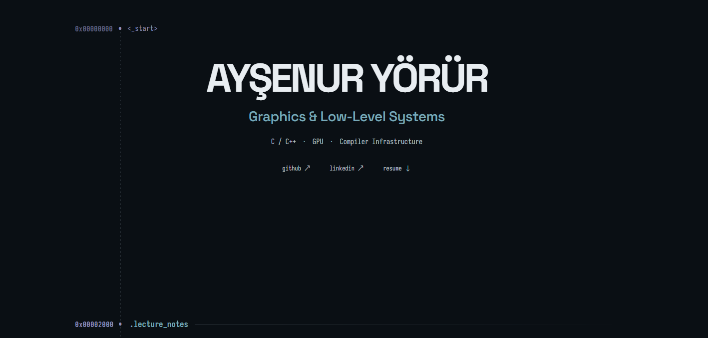
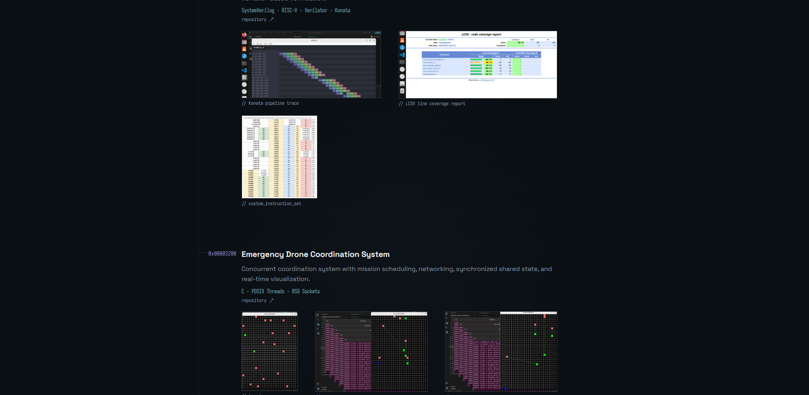

# megen

If you don't want to prepare your CV every time, update your website separately, or worry about the design, use megen (me generator). Just fill in your information and you're ready to go.

Just fill in [`profile.toml`](https://github.com/AysenurYrr/megen/blob/master/profile.toml) with your own information. Both your CV and portfolio website are generated from the same file.

You can easily choose which projects and sections appear on your CV, so you can create different versions for different job applications.

## Preview

<p align="center">
  
  
</p>

## Usage

1. Fork this repository.
2. Fill in `profile.toml` with your information.
3. Run:

```bash
make run
```

4. Enable **GitHub Pages** in your fork to publish your own portfolio.

That's it. Update `profile.toml`, and your CV and website stay in sync.


## License

Licensed under the Apache License 2.0. See [`LICENSE`](LICENSE) and [`NOTICE`](NOTICE).
